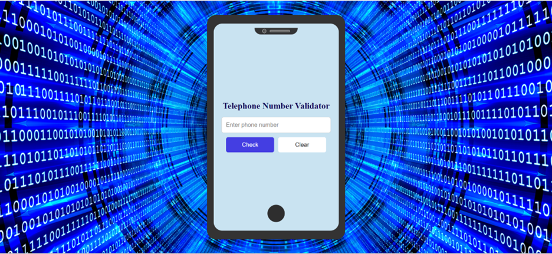

# Phone Number Validator 🚀

## A web tool for validating US phone numbers using JavaScript, with clear and check functionality. 📝

> This project is a simple phone number validation tool that checks if a user-provided phone number matches common US formats. Users can enter a phone number and click the "Check" button to see if it's valid. If the input field is empty, an alert prompts the user to provide a phone number. The results are displayed in color-coded text to indicate validity, and a "Clear" button allows users to reset the input and results. The tool is implemented using HTML, CSS, and JavaScript.

```css
.mobile {
  height: 100vh;
  display: flex;
  justify-content: center;
  align-items: center;
}
```

```javascript
document.getElementById('clear-btn').addEventListener('click', () => {
  document.getElementById('user-input').value = '';
  document.getElementById('results-div').textContent = '';
  document.getElementById('error-message').textContent = '';
});
```

## Demo 📸
[Live Demo](https://elhamy786.github.io/Telephone-number_validator/)


## Technologies Used 🛠️

- HTML
- CSS
- JavaScript

## Installation 💻


```bash
1: Clone the Repository:
git clone https://github.com/elhamy786/Telephone-number_validator.git
```

```bash
2: Navigate to the Project Directory:
cd Telephone-number_validator
```

```bash
3: Open the index.html style.css and script.js Files in Your Browser.
```

## Usage 🎯

```bash
"To use the phone number validation tool, enter a US phone number in the input field and click 'Check' to see if it's valid or 'Clear' to reset."
```

## Features ⭐

- Validates multiple US phone number formats
- Displays validation results with color-coded messages
- Provides clear and check button functionality

## Author 👩‍💻

- [Linkedin](https://www.linkedin.com/in/elham-afzali-05326130b?utm_source=share&utm_campaign=share_via&utm_content=profile&utm_medium=ios_app)
- [Email](elham.afzali1383@gmail.com)

## Contributing 🤝
Contribute by submitting bug reports, feature requests, or pull requests on the project's GitHub repository, ensuring to follow the contribution guidelines outlined in the README.
